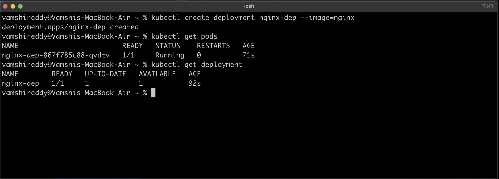
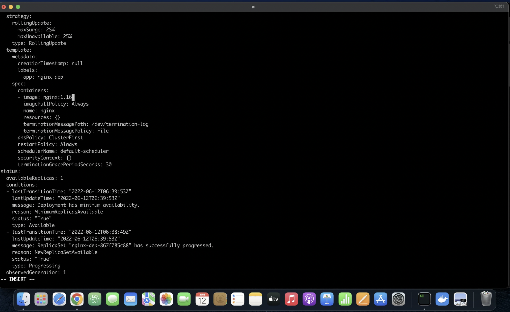
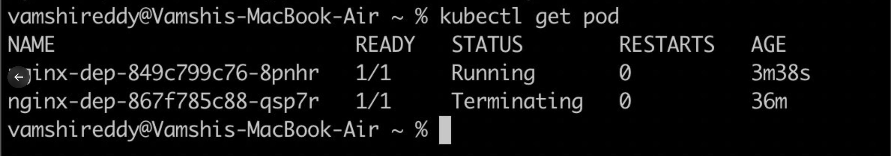
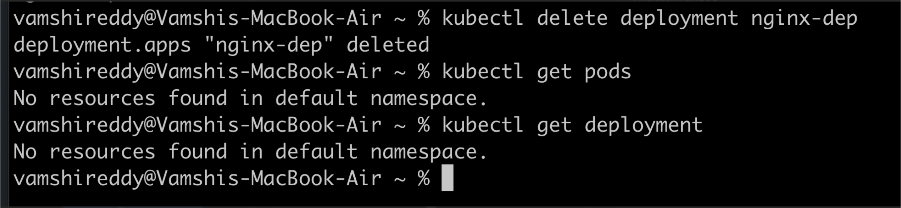

### 🟢 How to create a pod in Kubernetes cluster

By using the kubectl command:
kubectl create deployment  (pod-name)  --image=(image from docker hub)

### 🟢 How to edit the pod.
You can use this command:
kubectl edit deployment (pod-name)

🟢how to delete the pod.
You can use this command:
kubectl delete deployment (pod-name)

