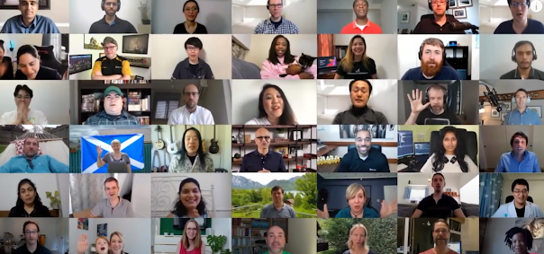
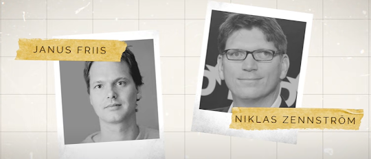
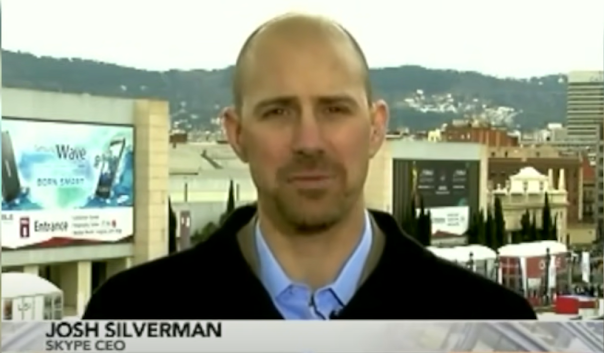
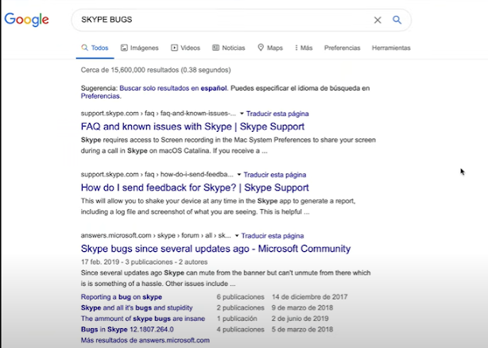
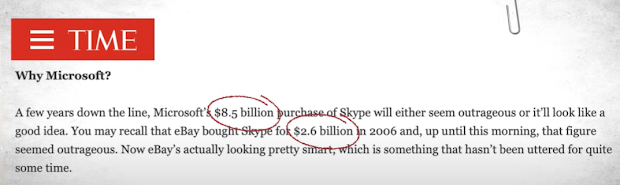
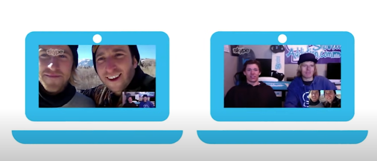

Sep 28, 2022
SKYPE: HOW MICROSOFT RUINED IT !

All of a sudden, video calls have become a part of our daily lives. From university classes and business meetings to birthdays and yoga. Online is the new normal and will be for a while. Fortunately, there are plenty of options, Zoom, meet, and Microsoft's own Teams. But, there is a name that seems to have disappeared. A name, mind you, that no so long ago was the go-to program for video calls. It's safe to say that, if all this happened, say, in 2010, we would've been Skyping. But now, we're doing anything but Skyping. What happened? Let me tell you in this blog of Company Forensics. 

The team behind Skype was talented, to say the least. Janas Friis and Niklas Zennstrom founded the company in 2003. Estonian developers Ahti Heinla, Priit Kasesalu, and Jaan Tallinn created the software. These guys also created Kazaa, which helped many of us "acquire" movies and games in the early 2000s. In fact, the peer-to-peer foundation that made Kazaa successful would be essential for Skype. Initially, because later, it would be a hindrance. In fact, it was in the name, originally conceived as Sky peer-to-peer, then it was reduced to Skyper, but trademark issues forced them to eliminate the r. The idea? Free calls over the Internet, using a voice-over IP (VoIP for short). This software turns the user's voice into data, then sends it as digital data packages over the Internet. But VoIP wasn't new. Actually, it existed for years so, what was new? Well, based on the software from Kazaa, Skype used peer-to-peer, which meant data didn't have to be processed by a central server. No central server meant less infrastructure, which was a cost-effective business model. Skype's seemed promising: lower call costs all around. The team was so confident that Jaanus Friis was quoted as saying: We hope that one day, instead of saying "I'll call you, people will say 'I'll Skype you". Spoiler alert: he was right. One month after the launch, one Million had downloaded the software. By mid-2006, Skype had over 115 Million Skype customers and was recognized as the fastest-growing interned community at the time. Skype's recipe was very attractive: calls within Skype were free, which were great! But also, Skype users could call land and mobile lines, known as SkypeOut. Regular land and mobile phone users could call a Skype account, known as SkypeIn. All for cheaper rates. In fact, it was so efficient that some countries eventually banned Skype altogether to protect their phone companies. Video calls boosted the software's popularity even more, and the company was beginning to attract possible buyers. Especially a certain online auction company called e-Bay, which dished out $2.6 billion for Skype in 2007. It seemed logical: Skype gave eBay better communications between buyers and sellers and helped reduce friction in eCommerce. The detail here is that both Friis and Zennstrom remained as part of the executive team. But the massive purchase rapidly proved flawed. The first criticism was its costs, as experts considered it aided in speculation. Just wait and see what happens later. 

Then Zennstrom and Friis constantly butted heads with eBay's executive, so much so. that by early 2008, Skype had gone through at least 5 Presidents and CEOs. Underperforming numbers and diminishing customers due to competition forced by eBay to write down Skype by $1.43 Billion in value. So, eBay pretty much admitted to having paid too much. Such was the friction in fact, that Zennstrom and Friis left. But they had an ace up their sleeve. After rotating through CEOs, Josh Silverman ended up in charge, in February 2008. Coming in from another section of eBay, his task was to douse the chaos inside the company, and he accomplished it. Perhaps, too well. He shifted his efforts towards video calls, revamped the subscription program, and created premium accounts. One key move was the creation of an iPhone app, which was a huge hit, with 1 Million downloads in just 2 days, as well as moving forward with an Android version. He also shed excess weight by removing plenty of features, including Skype's own version of the Yellow Pages, the "Skype me" feature which allowed non-contacts to call you removed the Skype-cast feature, recording software that could record conversations. The efforts seem to pay off as, in 2009, Skype grew at a rate of about 3,80,000 users a day and $740 million in revenue. But not everything was going smoothly. Some say that Silverman made Skype too stable and that much of the developments took too long. Plus, call reliability was steadily plummeting. Here's where P2P comes into play again. Yes P2P meant less lag between calls but Skype was prone to crashing as it relied heavily on individual PCs instead of central servers. 

When Friis and Zennstrom sold Skype, they didn't sell the peer-to-peer software. In fact, what they did in the past was license the software to Skype and other companies like Joost, an Internet video service, and Joltid, both of which were theirs. But when eBay announced that it would sell Skype to a group of investors in an effort to free itself of the flawed company, the cofounders said: Hold up! That's our technology you are selling. Legally, if Friis and Zennstrom were right, any possible sale would go bust. So, after much deliberation on the legal front, a deal was stuck in which Friis and Zennstrom ended up with 14% of shares in Skype. And the deal wasn't small: around $2.7 Billion and was finalized in 2009. In short, they sold it once, for a lot of money. Then got money on the second sale. That's a pretty smart move. eBay retained 30% and Silver Lake, the new investors, ended up with 56%. But once the legalities were over, both co-founders promised to invest heavily in the program, so excitement was high. And, as a somewhat independent company, Skype had some very good years. By 2010, 25% of the world's voice calls were through Skype, in a market that grew just 5% to 6% a year. With such numbers backing it up, Skype looked to raise $100 Million in an initial IPO, in hopes of eventually raising at least $1 Billion. But there was also talk of another sale, which included possible buyers like Facebook, and Microsoft. Not bad, at all. 

   

Yet, there's another side to the story. Yes, Skype seemed great. But it actually lost about $7 Million in 2010 and had long-term debt of close to $700 Million. So, the buyer would have to act fast to turn those numbers around. If you take the good and the bad, it seems like Skype wasn't that bad. And, this is Forensics, after all. So, what went wrong? Well, all roads lead to Microsoft. On May 11, 2011, the giant announced that it would acquire Skype for $8.5 Billion. Microsoft's offer represented a 300% increase in Skype's value, in a little over three years. Also, they were paying 32 times the operating costs, and the other offers, Facebook and Google, hovered about $3 Billion, which was closer to reality. So, people were left scratching their heads. Here's a quote from Time Magazine. A few years down the line. Microsoft's $8.5 Billion purchase of Skype will either seem outrageous or it'll look like a good idea. You may recall that eBay bought Skype for $2.6 Billion in 2006 and, up until this morning, that figure seemed outrageous. Now eBay's actually looking pretty smart, which is something that hasn't been uttered for some time. Microsoft had a good product to start with. Skype was good in those years, as it now had 40% of the world's calls and even the Oxford dictionary included the verb Skype. So, good one, Friis. But where did it go wrong? 

Well P2P again comes into play. What had made Skype successful and what had determined the legal future of the company was its biggest hindrance. P2P was great between computers but worked horribly with mobile phones. In 2013, Microsoft made the right in migrating to cloud-based servers. Sounds great, right? Well, yes. If you could do it quickly and efficiently. Instead, the transition lasted months which evolved into years. And the bad thing was that Skype was all over new Microsoft products like Windows 8.1, the Xbox One Console, and the outlook package. Users might remember when Skype calls came through on two devices instead of one. Calls ended abruptly, notifications would come in on one device and not the other, Group calls were hard to set up and then, there was one of its annoying flaws: updates. Just as you were planning for a big video presentation, minutes before starting, Skype decided to update itself, without warning. And you were left cursing and frustrated. Meanwhile, competition like Whatsapp was working hard at messaging and zoom was working hard at videocalls. And they weren't alone, with other options like meet and house party rising up the ranks. But what did Microsoft do? Well, not much. They included weird text-activated emojis, they launched and dismantled a video messaging app. Their efforts to make Skype better lacked planning, so it wasn't unusual to face updates on a monthly basis. And each update changed the software almost entirely. Around 2016, many Skype users stuck to Skype because well, others used it. And, somehow, those were good numbers: an estimated 300 million users, in fact. But as threats were popping up left and right, Skype's biggest threat came from Microsoft itself. 

In 2016, Microsoft launched Teams, unified communication, and collaboration platform directed towards business. It was Microsoft's view of evolving its Skype for Business software and, all in all, it was a solid proposal with messaging, video calls, calendar organization, and virtual meetings. All very businesslike. Plus, by the end of 2017, Skype was still the go-to software for calls to landlines, but user's confidence was diminishing. It just didn't have much much else. The new redesign was universally hated as it was plagued with bugs and missed what the past versions good. So, the app ratings plummeted. Meanwhile, take a direct competitor: Zoom. It was easy to use, users didn't have to be members, and got 40 minutes for free. It's as though it's designed for non-techies. Well, it is designed for non-techies. And that was the key. Skype's user experience wasn't kind. Just Google Skype bugs and you'll have plenty of search results to indulge in. Then there were Microsoft's interests themselves. From 2016 to now, Teams had improved constantly, because Microsoft was investing heavily in it. They took all the good from Skype and improved all the bad: data transfer, tasks, video, and calls. And life changes, constantly. Take this moment for instance. As things become even more virtual, Skype's use has increased, but so has Teams. And Microsoft was been pretty honest about maintaining Skype as a "for-the-moment" tool as eventually, they would migrate everybody to Teams. Microsoft even announced a Teams for consumers version, which was widely celebrated. And that's how much people hated Skype. Who celebrates the death of software? Well, those in the end, Microsoft learned a lot from Skype. Teams seem the adequate evolution, taking the good, leaving the bad, improving altogether. But the lessons learned were worth $8.5 Billion. Would you pay $8.5 Billion for lessons? If not then hit the subscribe button above and wait for my rest of the blogs.  